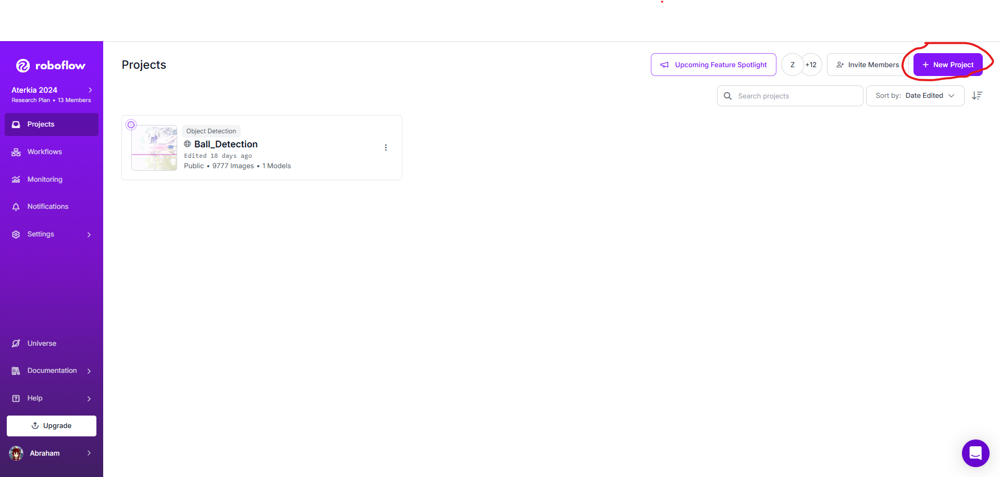

# Data Collecting Documentation

This documentation is about how to get the dataset for our Computer Vision Project (whether it's annotated or unannotated):

### Get Dataset From The Internet

#### Roboflow Universe

You can get datasets from **Roboflow Universe**. Just search for the dataset you want and download it. Once you've got it, extract it to your computer.

Click the link to visit the site: [Roboflow Universe](https://universe.roboflow.com/)

#### Kaggle

Just like Roboflow Universe, you can search for the dataset you want on **Kaggle** and download it (usually as a CSV file or other formats). After downloading, move it to your computer.

Click here to go to Kaggle: [Kaggle](https://www.kaggle.com/)

#### Open Image Dataset

Another option is **Open Image Dataset**. This one’s a bit different because you can directly call it from your code before you start training your model.

Check it out here: [Open Image Dataset](https://storage.googleapis.com/openimages/web/index.html)

---

### Get Your Own Custom Dataset
You can also create your own custom dataset using your camera or another device. If you're going for a custom dataset, it’ll likely be unannotated, so here’s the step-by-step process to get that:

1. **Capture Images or Videos**
   Use your device (camera, phone, whatever) to capture the images or video you need. 
   

2. **Edit Your Video**
   If you’re using a video, edit it so that it only contains the objects you want to detect. Cut out all the extra 'spam' scenes.
   

3. **Go to Roboflow**
   Now, head to **Roboflow** by clicking here: [Roboflow](https://roboflow.com/)
   

4. **Sign In or Sign Up**
   Log in to your account, or create one if you don’t have it yet.
   

5. **Create Your Workspace**
   First things first, create your workspace. Give it any name you like, choose your plan (if it’s your first time, pick the **Public Plan**). Once that’s done, click **Create Workspace**. You can add another email if you’re working with a team, or skip if you’re flying solo.
    

6. **Start a New Project**
   Click on **New Project** to start a fresh project. Give your project a name (e.g., "Ball Detection"), and enter your annotation group name (e.g., "balls"). For this project type, **Object Detection** is what you’ll need for this.
   
   Here's the breakdown in a table format:

| **Option**             | **Description**                                                     |
|------------------------|---------------------------------------------------------------------|
| **Object Detection**    | Find objects using bounding boxes and track their position.        |
| **Classification**      | Recognize objects and assign labels.                               |
| **Instance Segmentation** | Color in objects to match their exact shape.                        |
| **Keypoint Detection**  | Get the “skeleton” or stickman of an object (and track it too).    |

   Once done, click **Create Public Project**. Your project page will pop up.
    

7. **Upload Your Files**
   Choose to upload either a file or a folder. If you’re using a dataset from Roboflow Universe, Kaggle, or another source, you’ll likely be using a folder with your annotated dataset.
   

8. **Adjust Your FPS**
   Fit the FPS (frames per second) for your video. 
   - **More FPS** = More dataset, higher accuracy for situations in your video.
   - **Less FPS** = Less dataset, but more variety in the situations your model might encounter.
   
   Once you've set your FPS, click **Choose Frame** and wait for it to complete.
   

9. **Ready for Labeling!**
   Now you’re all set for data labeling. Time to mark up those images or video frames!
   

---

With this guide, you should be all set to collect and prepare your dataset for a computer vision project! 😎 Let me know if you need any more help!

By The Way guys, you can download latest our dataset in this link [Aterkia-KKI-2024-Last Dataset](https://app.roboflow.com/aterkia-2024/ball_detection-3p0tu/7). Lets enjoy to label images, hehe. 