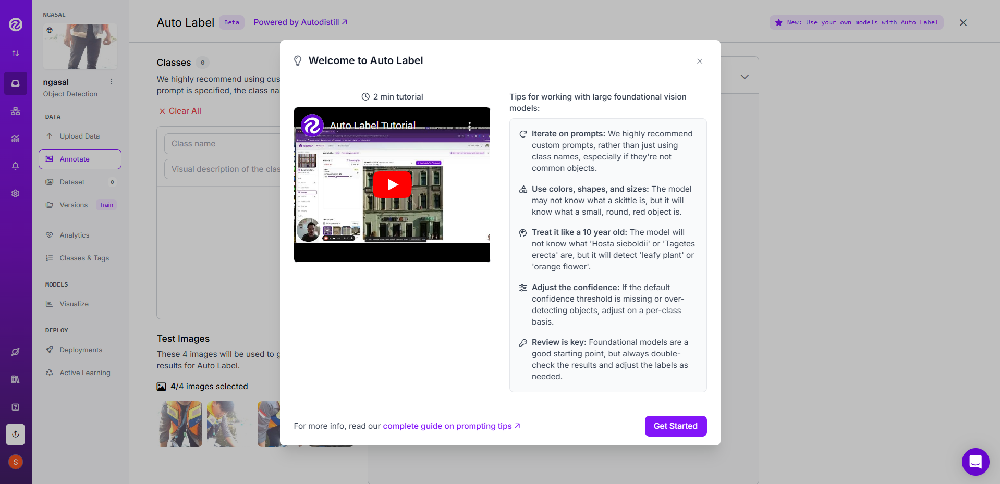
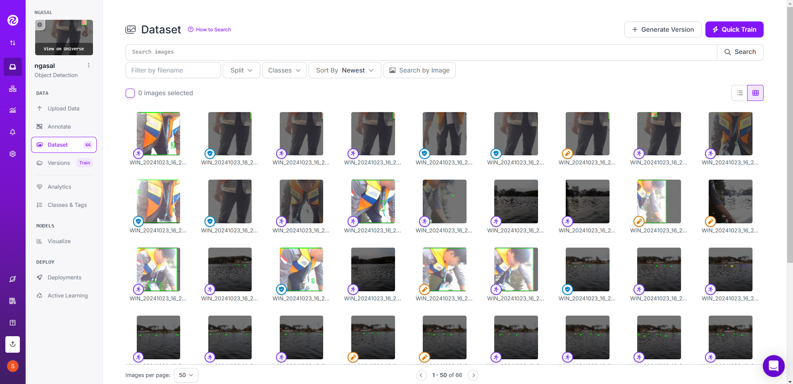

# Data Labelling Documentation

Alright, folks! This is your guide on how to label an unannotated dataset for your Computer Vision Project. Let’s dive in!

### Choose Your Labelling Style

There are three ways to label your images—take your pick!

**1. AutoLabel**  
Use a fancy AI model to automatically label your images.  
**(+)** Quick, no hand cramps!  
**(-)** Sometimes it gets wonky if you mix it with manual data. Plus, the free plan only gives you 1,000 images per month.  

**2. Roboflow Team**  
Hire professional human labelers. You know, the real experts!  
**(+)** High-quality labels, like, chef’s kiss!  
**(-)** YOU MUST BE RICH!  

**3. Manual Label**  
Do it yourself, DIY-style. Consider it “character building”!  
**(+)** It’s free, and you control everything.  
**(-)** Say goodbye to your free time and hello to sore fingers (LOL, wkwk).  

### How to Label Manually (For the Brave)

So, you’ve decided to go manual, huh? Bold choice. Here’s how to do it step-by-step:

1. **Prepare Classes & Tags**  
   Double-check your classes (or make up a few if you’re feeling creative). You can add or tweak them as you like. It’s all you!
   

2. **Start Annotating**  
   Go to **Annotate**, click on an image, and get started! Since we’re doing detection, pick the **Bounding Box Tool** on the right. Draw a box around each object (say, a ball), and choose the right class. Adjust it like you’re fine-tuning a pizza slice—precision matters!
   

3. **Edit Annotations**  
   Need to make changes? No problem. Use the **Hand** tool on the right. Resize the box, change its class, or toss it if it’s off. You’re the boss here.
    

4. **Save as You Go**  
   Don’t forget to hit **Save** (or press Enter) after each annotation. No one wants to lose progress because they missed this step. Now keep it up until you’re all done. You got this!
   

5. **Add to Dataset**  
   Once everything is labeled, click **Add Image to Dataset**. Here’s the usual split:
   - **Train**: 70% - where AI does most of its learning.
   - **Validation**: 20% - so the AI can check its guesses during training.
   - **Test**: 10% - the big final exam.
    
   Adjust as needed, and watch the images magically disappear from **Annotating**!
    

6. **Ready to Generate**  
   Head over to the **Dataset** section in the left navigation bar. Make sure everything’s in order. Now you’re ready to generate data like a pro! Go on, do your thing!
    

---

That’s it! With this guide, you’ll be labeling datasets like a data guru in no time. Remember, have fun with it (and stretch those fingers).