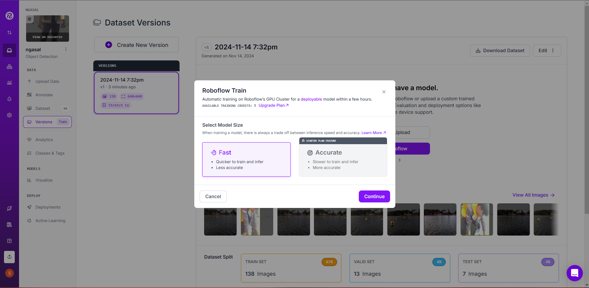

# Generating Dataset Version Documentation

Alright, this is probably the quickest part of our Computer Vision Project. Let’s jump right in!

## Source Images

Start with your unannotated images. These are your raw materials, so no need to annotate them again—just skip ahead!  

---

## Train/Test Split

Here, you decide how to split your dataset. A typical setup is **70% for training**, **20% for validation**, and **10% for testing**. This helps the model learn, validate, and test its performance effectively.  

---

## Preprocessing

Preprocessing helps reduce training time and improves inference speed, which is the time it takes your model to make predictions. Here’s a breakdown of each preprocessing option:

| **Option**                | **Description**                                                                                 |
|---------------------------|-------------------------------------------------------------------------------------------------|
| **Auto-Orient**           | Automatically adjusts the image orientation to make sure all images are upright.               |
| **Resize**                | Resizes images to a standard size, which is great for keeping training consistent.             |
| **Isolate Objects**       | Highlights the object area, so the model can focus only on it.                                  |
| **Static Crop**           | Crops images to a specific area, keeping the same portion of each image.                       |
| **Dynamic Crop**          | Crops images dynamically around the object to keep it centered.                                |
| **Grayscale**             | Converts images to grayscale. Good for models that don't need color info.                      |
| **Auto-Adjust Contrast**  | Enhances contrast automatically to make objects stand out.                                     |
| **Tile**                  | Divides images into smaller parts, creating a new dataset with zoomed-in views.               |
| **Modify Classes**        | Allows you to add or remove object classes within the dataset.                                 |
| **Filter Null**           | Removes images without annotations, so they don’t confuse the model.                           |
| **Filter by Tag**         | Filters images by specific tags for better control over training.                              |

---

## Augmentation

Augmentation is a way to create new examples for your model to learn from. By modifying images, the model learns to recognize objects under different conditions. Here’s a quick look at the options:

### Image Level Augmentations

| **Augmentation**        | **Description**                                                              |
|-------------------------|------------------------------------------------------------------------------|
| **Flip**                | Flips the image horizontally or vertically.                                  |
| **90° Rotate**          | Rotates the image by 90 degrees for more angle diversity.                    |
| **Crop**                | Randomly crops parts of the image.                                           |
| **Rotation**            | Rotates images to varying degrees for more orientation data.                 |
| **Shear**               | Stretches the image, changing its angle slightly.                            |
| **Grayscale**           | Converts the image to grayscale to reduce color complexity.                  |
| **Hue**                 | Changes the image hue, making colors slightly different.                     |
| **Saturation**          | Adjusts color saturation to train the model on color intensity variations.   |
| **Brightness**          | Varies image brightness to simulate different lighting.                      |
| **Exposure**            | Adjusts exposure levels for varied brightness in images.                    |
| **Blur**                | Adds blur to images to help the model learn from less-sharp inputs.         |
| **Noise**               | Adds noise for robustness against noisy environments.                        |
| **Cutout**              | Randomly “erases” parts of the image.                                        |
| **Mosaic**              | Blends multiple images to create new training examples.                      |

### Bounding Box Level Augmentations

These work at the object level, adding variety to specific object appearances within an image.

| **Augmentation**        | **Description**                                                              |
|-------------------------|------------------------------------------------------------------------------|
| **Flip**                | Flips the bounding box area horizontally or vertically.                      |
| **90° Rotate**          | Rotates the bounding box area by 90 degrees.                                 |
| **Crop**                | Crops around the bounding box area.                                          |
| **Rotation**            | Rotates only the bounding box for a specific object.                         |
| **Shear**               | Shears the bounding box to change its angle slightly.                        |
| **Brightness**          | Adjusts brightness inside the bounding box.                                  |
| **Exposure**            | Changes exposure inside the bounding box.                                    |
| **Blur**                | Adds blur to the bounding box area.                                          |
| **Noise**               | Adds noise within the bounding box for robustness.                           |

---

## Create

Finally, it’s time to **create the dataset version**. You can adjust the version size to balance between training time and model performance. Bigger versions may take longer to train but often lead to better model accuracy.  

---

## Dataset Version

Once you’ve generated your dataset version, it’s ready to train! You can also use **Custom Train and Upload** to link your dataset with your Roboflow account and configure it with models like YOLO (which we’ll discuss soon).  
  

You can also download your dataset in a ZIP file if you prefer to train locally.  

---

## Train with Roboflow

If you’re feeling adventurous, you can train locally in Roboflow (although we usually go manual). Just click **Train with Roboflow** and follow the steps. Select your model size, set up checkpoints, and wait for it to finish training.  
  
  
  

---

Ok, get ready! Next up: we’re diving into code. Hihihiha!