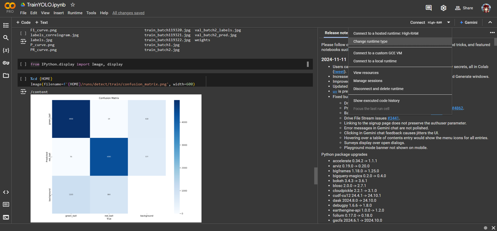
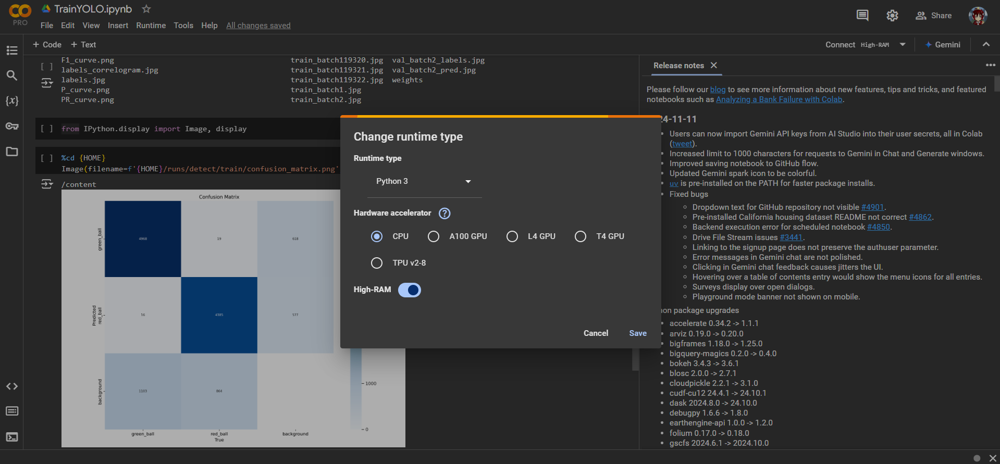

# Data Training Documentation

Alright, let’s get coding! Here’s your step-by-step guide to training your model with YOLO. I’ll keep the explanations short and let the code do the talking.

---

## Setup Runtime

Before starting, make sure to select a GPU runtime in Google Colab. If you're using the free version, your runtime will be limited to 4 hours, but a paid plan will allow for longer training times and additional cores.




---

## Preparation

First, check if the GPU is ready for training.

```bash
!nvidia-smi
```

Then, set up the working directory to make navigating your project easier.

```python
import os
HOME = os.getcwd()
print(HOME)
```

---

## Installing YOLO and Necessary Libraries

Start by installing the required libraries.

```bash
!pip install -q supervision
```

Now, install YOLOv10 from its GitHub repository.

```bash
!pip install -q git+https://github.com/THU-MIG/yolov10.git
```

Next, download the YOLOv10 pre-trained weights. These weights are optimized for different model sizes, allowing you to choose the version that best suits your needs.

```bash
!mkdir -p {HOME}/weights
!wget -P {HOME}/weights -q https://github.com/THU-MIG/yolov10/releases/download/v1.1/yolov10n.pt
!wget -P {HOME}/weights -q https://github.com/THU-MIG/yolov10/releases/download/v1.1/yolov10s.pt
!wget -P {HOME}/weights -q https://github.com/THU-MIG/yolov10/releases/download/v1.1/yolov10m.pt
!wget -P {HOME}/weights -q https://github.com/THU-MIG/yolov10/releases/download/v1.1/yolov10b.pt
!wget -P {HOME}/weights -q https://github.com/THU-MIG/yolov10/releases/download/v1.1/yolov10x.pt
!wget -P {HOME}/weights -q https://github.com/THU-MIG/yolov10/releases/download/v1.1/yolov10l.pt
!ls -lh {HOME}/weights
```

---

## Setting Up the Dataset Folder

Create a directory to store your dataset files.

```bash
!mkdir {HOME}/datasets
%cd {HOME}/datasets
```

Now, install the Roboflow library to import datasets directly.

```bash
!pip install roboflow
```

Then, import your dataset from Roboflow. This example uses your API key to download the specified dataset to the Colab environment.

```python
from roboflow import Roboflow
rf = Roboflow(api_key="pmoRhHoc26cvpbWEoE5Z")
project = rf.workspace("aterkia-2024").project("ball_detection-3p0tu")
version = project.version(7)
dataset = version.download("yolov8")
```

Finally, install the Ultralytics package to ensure YOLOv8 compatibility.

```bash
!pip install ultralytics
```

---

## Training the Data

Before starting the training, check the `data.yaml` file to ensure paths for `train`, `valid`, and `test` datasets are correctly specified.

To start training, run the command below. If you're using the free version of Colab, note that runtime is limited to 4 hours.

```python
%cd {HOME}

!yolo task=detect mode=train imgsz=320 epochs=200 batch=32 iou=0.5 half=True plots=True \
model={HOME}/weights/yolov10n.pt \
data={dataset.location}/data.yaml
```

**Note:** If you encounter an error involving `numpy.ndarray`, it’s likely due to a version mismatch in the YOLO library. Try running the following command to resolve it:

```bash
!pip install albumentations==1.4
```

---

## Checking Model Accuracy

After training, you can check the model's performance by viewing the results.

First, list the contents of the training directory to locate your output files.

```bash
!ls {HOME}/runs/detect/train/
```

Then, import the display function to view the results.

```python
from IPython.display import Image, display
```

Load the confusion matrix to see how well the model identified each class.

```python
%cd {HOME}
Image(filename=f'{HOME}/runs/detect/train/confusion_matrix.png', width=600)
```

And load the results graph to review performance metrics over time.

```python
%cd {HOME}
Image(filename=f'{HOME}/runs/detect/train/results.png', width=600)
```

---

## Downloading the Model

After training, you'll typically want to download the `best.pt` file, which contains the trained model's weights. However, for a more comprehensive backup, download the entire `detect.zip`, which includes all training results.

To compress and download the training folder, use the following command:

```bash
!zip -r /content/detect.zip /content/runs/detect/train
```

Then, download the ZIP file directly to your local machine.

```python
from google.colab import files
files.download('/content/detect.zip')
```

---

That’s it! Now you’re ready to start training your model and analyzing the results. Actually, you can see this programming in [this link](https://colab.research.google.com/drive/1Wa-i2DOUVOHsZcSoruYwqhrZI8TdAVrC#scrollTo=Xuke00fr-aDp) . Dive into the code and enjoy your learning journey—good luck!


