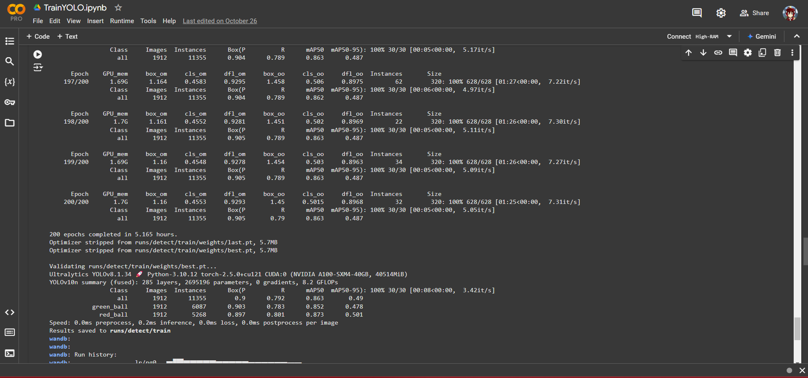

# Computer Vision Programming Documentation

This documentation outlines the stages of computer vision programming as applied in the *Kontes Kapal Indonesia 2024* project. This work is an official property of:

  

  

## 1. Data Collecting

The first step in computer vision programming is gathering data. This data can include images or video from the environment, which will later be used to teach the computer vision model how to identify specific objects or patterns.

## 2. Data Labeling

Data labeling is the process of marking or annotating collected data with labels to identify objects or features. This step is essential because it helps the computer understand what each object in the image represents, making it possible for the model to recognize them accurately.

## 3. Generating Dataset Versions

Once data is labeled, it needs to be organized into a structured dataset. In this step, we create specific versions of the dataset, adjusting configurations to improve the training process. Different versions help fine-tune the model for optimal performance.

## 4. Data Training

Data training is where the computer vision model learns from the labeled dataset. The model uses this data to identify and classify objects or patterns. This step is critical, as a well-trained model is necessary for accurate results in computer vision applications.

## 5. Computer Vision Programming

Computer Vision (CV) programming involves writing and implementing the code that enables the computer vision algorithms to function. This final step brings the system together, enabling it to recognize and respond to visual data in real time.

Each of these stages contributes to developing a robust computer vision model that can accurately interpret and respond to its environment.
